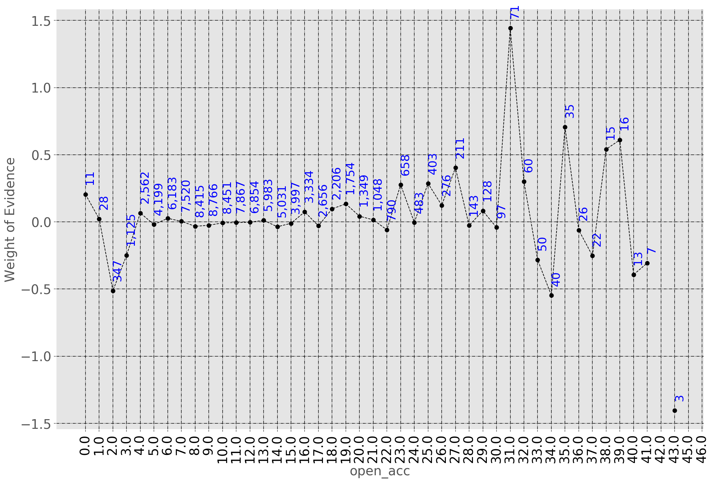

# Project Description
In this project, I build a scorecard for the insurance modelling.
The data is taken from [lending club](https://www.lendingclub.com/). Here,
I am using years 2007-2014 for data and 2015 as testing.

# Data Preparation
For the insurance data modelling, I binned the continous variables using Weight of Evidence methods.
For example, the continous feature `open_acc` was broken into multiple discrete bins as shown below:

There are many small number and woe curve is flat.
I looked at number of observations and group them to following bins:
```
open_acc:<=3
open_acc:4_5
open_acc:6_13
open_acc:13_17
open_acc:>17
```
# Insurance Modelling
Then with the clean binned data, I used logistic regression to estimate the probability of good and bad policies.
- Build logistic regression and got the p-values.
- Feature selection using p_values
- Logistic Regression with p-values selected features.
- Do the model evaluation on test data.
- Plot Gini Curve.
- Plot Kolmogorov-Smirnov curve.
- Then I built the scorecard.


# EDA Results


